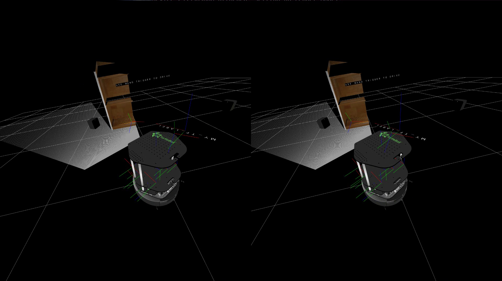

Visualization node for ROS using OpenVR
=======================================

[](http://www.youtube.com/watch?v=M0u4YXW0DFU "VRViz Turtlebot Demo")

This code was built from the [openvr](https://github.com/ValveSoftware/openvr) 
example code, and adapted to run in catkin and to display ROS messages in 
virtual space running natively on Ubuntu. There is currently not many message types implemented, and in the future it may be more sensible to turn this into an rviz plugin rather than continue re-implimenting message types here.

Prerequisites
-------------

The main dependancy is SteamVR, which can be installed from [Steam](https://store.steampowered.com/). Additionally you will need a VR headset compatable with openvr. This code has only been tested with the HTC Vive, but it is possible that other headsets supported by steamvr such as the Oculus Rift could work as well.

Several library dependancies are included in the the repo, the [openvr](https://github.com/ValveSoftware/openvr) 
library, which is included in `openvr_library` and sdl2 which is included in `sdl2_library`.

The code is designed to be used in ROS, and has been tested in ROS Kinetic on Ubuntu 16.04. Instructions for installing ROS can be found [here](http://wiki.ros.org/ROS/Installation) and other than the turtlebot demo, all ROS dependencies should be covered by `ros-kinetic-desktop-full`.

The non-ROS dependencies include GLEW for rendering and [assimp](http://www.assimp.org/) for loading URDF robot models with Collada meshes.
These should be able to be installed with:
```
sudo apt-get install libglew-dev libassimp-dev
```

Running with Steam Runtime
--------------------------

For now, this node requires being run as part of the steam runtime (or as shown in vrviz.launch):
```
rosrun --prefix '~/.steam/ubuntu12_32/steam-runtime/run.sh' vrviz vrviz_gl
```

Demonstration Launch Files
--------------------------

For a demo of showing a Turtlebot in Gazebo, install `ros-kinetic-turtlebot-gazebo` and run:
```
roslaunch vrviz turtlebot_demo.launch
```
This should load up the robot, and it can be controlled by pulling the trigger of the controller and then moving/rotating the wand while the trigger is depressed. This launch file will fix the 'ground' of the vive to the `odom` frame. See an example youtube video [here](http://www.youtube.com/watch?v=M0u4YXW0DFU "VRViz Turtlebot Demo").

For a demo showing a bagfile download the `demo_mapping.bag` file from [here](http://wiki.ros.org/rtabmap_ros) and run:
```
roslaunch vrviz point_cloud_demo.launch bagfile:=/path/to/demo_mapping.bag
```

Features
--------
 - The default RViz 1m grid
 - Scaling the VR world relative to the ROS world (currently set by rosparam at startup)
 - Loading a robot model from the parameter server with `load_robot:=true`
 - Visualizing TF's (currently only TF's that have been referenced somewhere)
 - Visualizing PointCloud2 messages (currently expecting color)
 - Visualizing stereo pair image (currently expects one side-by-side image)
 - Visualizing visualization messages (currently expecting cube, sphere, cylinder or text)

Limitations
-----------
 - The code is very much a work in progress, and many features are partially or inefficiently implemented.
 - The [SteamVR support for Ubuntu](https://github.com/ValveSoftware/SteamVR-for-Linux) is still in Beta, so be careful.

Vulkan
------
As much as possible, the code has been created to keep the opengl specific things separate in order to allow building either with vulkan or opengl (based on the fact that the `open_vr` examples of opengl and vulkan, which this was built from, are very similar). However, while the vulkan executable (`vrviz_vk`) builds and links, it does NOT have any real functionality to speak of, and would require some work to bring up to the level of `vrviz_gl`. It is currently commented out of the CMakeLists and does not build.

